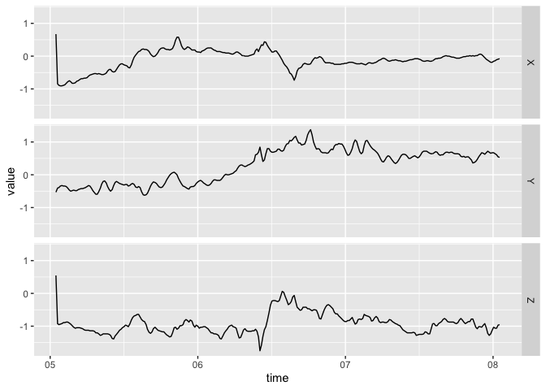
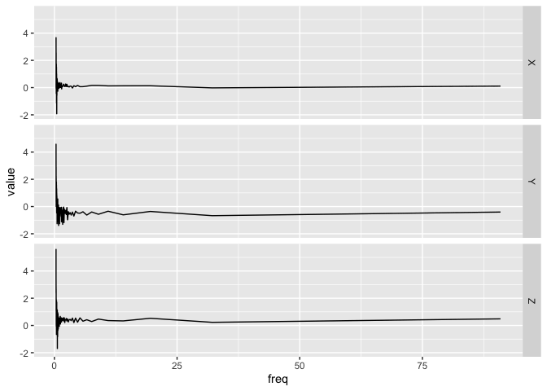

<!-- README.md is generated from README.Rmd. Please edit that file -->

# bis620.2022

<!-- badges: start -->

[](https://github.com/tianyi-chu/bis620.2022/actions/workflows/R-CMD-check.yaml)
[](https://app.codecov.io/gh/tianyi-chu/bis620.2022?branch=main)
[](https://github.com/tianyi-chu/bis620.2022/actions/workflows/lint.yaml)
[](https://github.com/tianyi-chu/bis620.2022/actions/workflows/test-coverage.yaml)
<!-- badges: end -->

The goal of bis620.2022 is to analyze the accelerometry data ukb_accel
by plotting time series plots from the data using the accel_plot()
function from plot.R. The spectral_signature() function from spectral.R
can be used to create spectral signatures.

## Installation

You can install the development version of bis620.2022 from
[GitHub](https://github.com/) with:

``` r
# install.packages("devtools")
devtools::install_github("tianyi-chu/bis620.2022")
```

## Example

This is a basic example which shows you how to plot a time-series plot
from the data:

``` r
library(bis620.2022)
data(ukb_accel)
## basic example code
accel_plot(ukb_accel[1:300, ])
```



And here is an example which shows you how to plot the spectral
signatures:

``` r
data(ukb_accel)
ukb_accel[1:300, ]|>
  spectral_signature(take_log = TRUE)|>
  accel_plot()
```


